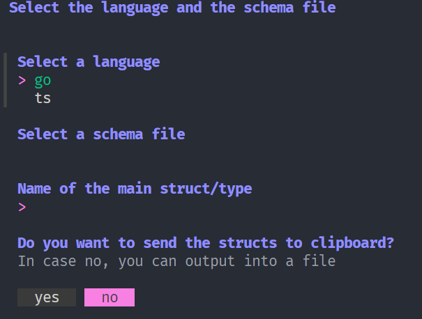

# SchemToTypes

SchemToTypes is a command-line interface (CLI) tool that converts API JSON/YAML schema into types for Go or TypeScript.

## Features

- Convert API JSON/YAML schema into Go types
- Convert API JSON/YAML schema into TypeScript types

## Installation

To install schemToTypes cli if you have golang in your system you can run the following command:

```bash
go install https://github.com/TheAPIguys/schemToTypes
```

## Usage

```bash
schemToTypes go -f schema.json -n myTypes 
```

```bash
schemToTypes ts -f schema.json -n myTypes 

```

```bash	
schemToTypes help
```

```bash	
schemToTypes 
```
alone command is a guide to the usage of the tool
